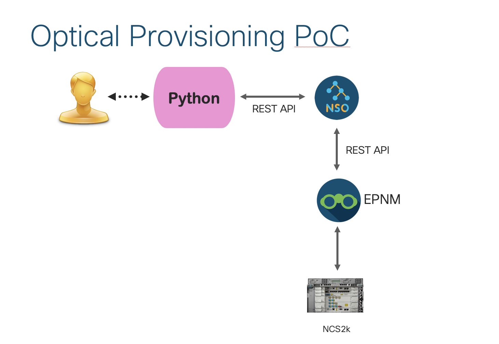

# NSO to EPNM Optical Service

A python script to create and delete optical services (OCHCC) through REST API calls to NSO.  NSO then communicates to EPNM and launches the service.  



The python "create_service.py" script will create the necessary internal patchcords for the deployment of the OCHCC service.  The site names, endpoints, links and service names need to be modified to your specific EPNM parameters.  I have left my parameters for reference in the code.  The python script uses the NSO APIs to send the necessary parameters from the json templates to NSO.  NSO utilizes an EPN-M NED to communicate the parameters to create the patchcords and deploy the service over the patchcords links.  

The python "delete_service.py" script will delete the service and remove the internal patchcords.  The service names, links, endpoints and site names need to be modified to your specific EPNM parameters.  Again I have left my parameters for reference in the code.  The delete operation is the same as the create but the necessary parameters for the NSO API to perform the operation is less.  


## Contacts:
* Jason Mah (jamah@cisco.com)

# Solution Components
* Python3
* NSO
* EPN-M
* NSO NEDs - EPN-M package 1.0.4 or above


# Installation

Create a constants.py file and add the following variables:

```bash
# NSO server IP and Username and Password
NSO_URL = "http://x.x.x.x:8080/"
NSO_USER = "nso_username"
NSO_PASSWORD = "nso_password"

# EPNM server IP and port and NSO device name
EPNM_IP = "x.x.x.x"
EPNM_PORT = "443"
EPNM_DEVICE_NAME = "EPNM1"  #EPNM NSO server name
```
# Usage

To launch an optical service create:

```bash
$ python create_service.py
```

To launch an optical service delete:

```bash
$ python delete_service.py
```


## License

Provided under Cisco Sample Code License, for details see [LICENSE](./LICENSE)

## Code of Conduct

Our code of conduct is available [here](./CODE_OF_CONDUCT.md)

## Contributing

See our contributing guidelines [here](./CONTRIBUTING.md)
